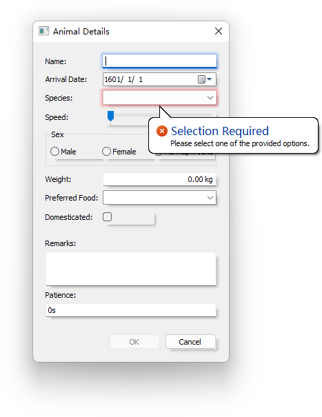

# Walk


## rsrc

```bash
rsrc -manifest xxx.exe.manifest -o rsrc.syso
```


## window
```go
var w *walk.MainWindow

window := MainWindow{
	AssignTo: &w,
	Title:    "test",
	MinSize:  Size{600, 400},
	Layout:   VBox{},
	Children: []Widget{
        //···
	},
}
window.Create()
//各种set操作
//...
w.Run()
```

#### 方法

```go
w.Screenshot()//截屏
w.Synchronize(func() {//加入消息队列
    //···
})
```

#### Set

```go
//设置坐标
w.SetX(0)
w.SetY(0)
//设置大小
w.SetHeight()
w.SetWidth()
w.SetSize(walk.Size{
	Width:  100,
	Height: 100,
})
//设置极限大小
w.SetMinMaxSize(walk.Size{
	Width:  100,
	Height: 100,
}, walk.Size{
	Width:  100,
	Height: 100,
})
//设置窗口标题
w.SetName("hello")
//设置窗口图标
i, err := walk.NewImageFromFileForDPI("icon.png", 96)
if err != nil {
	fmt.Println(err)
	return
}
w.SetIcon(i)
//全屏
w.SetFullscreen(true)
//得到焦点
w.SetFocus()
//置顶
w.BringToTop()
//设置是否禁用
w.SetEnabled(false)
//设置鼠标参数
w.SetCursor()
//设置字体
w.SetFont()
//设置背景
w.SetBackground()
//不允许窗口大小调整
win.SetWindowLong(w.Handle(), win.GWL_STYLE,
	win.GetWindowLong(w.Handle(), win.GWL_STYLE)&^win.WS_MAXIMIZEBOX&^win.WS_THICKFRAME)
```

### 事件

```text
OnBoundsChanged    walk.EventHandler
OnKeyDown          walk.KeyEventHandler
OnKeyPress         walk.KeyEventHandler
OnKeyUp            walk.KeyEventHandler
OnMouseDown        walk.MouseEventHandler
OnMouseMove        walk.MouseEventHandler
OnMouseUp          walk.MouseEventHandler
OnSizeChanged      walk.EventHandler
```


## win包

```go
win.SetWindowLong(w.Handle(), win.GWL_STYLE,
	win.GetWindowLong(w.Handle(), win.GWL_STYLE)&^win.WS_MAXIMIZEBOX)//禁用最大化按钮
//···
win.RemoveMenu(win.GetSystemMenu(window.Handle(), false), win.SC_CLOSE, win.MF_BYCOMMAND)//禁用关闭按钮
//···
win.SetCursorPos(100, 100)//设置鼠标位置
win.GetWindowRect()//屏幕大小
win.ScreenToClient()//屏幕坐标=>窗口坐标
win.ClientToScreen()//窗口坐标=>屏幕坐标
```

### WS_

```text
win.WS_MAXIMIZEBOX 有最大化按钮
win.WS_MINIMIZEBOX 有最小化按钮
win.WS_THICKFRAME 允许拉伸窗口大小

```

### 其他函数

```go
walk.DriveNames()
```


## 数据绑定

### Bind

```go
Bind(表达式，验证器)
```

### 验证器

```go
Range//是否在范围内
Regexp//是否匹配正则
SelRequired//是否已经选择（用于Combobox等）

```

### 运算符

```text
拼接：'Hello' + 'World'
等于：'Hello' == 'World'
不等于：'Hello' != 'World'
否定：!Hello.Visible
与：Hello.Visible && World.Visible
或：Hello.Visible || World.Visible
三元运算符：Name == '' ? 'Hello' : 'World'
```

### 自定义函数

```go
MainWindow{
	//···
	Children: []Widget{
		Label{
			Text: Bind("join(Hello.Value, World.Value)"),
		},
	},
	Functions: map[string]func(args ...interface{}) (interface{}, error){
		"join": func(args ...interface{}) (interface{}, error) {
			//数字：float64
			//字符串：string
			//布尔值：bool
			return args[0].(string) + args[1].(string), nil
		},
	},
}

```

### MutableCondition

```go
var OK = walk.NewMutableCondition()
MustRegisterCondition("IsOK", OK)
OK.Satisfied()
OK.SetSatisfied(!OK.Satisfied())
```

### 表单

```go
package main

import (
	"fmt"
	"github.com/lxn/walk"
	. "github.com/lxn/walk/declarative"
	"log"
)

func main() {
	var db *walk.DataBinder
	var data struct {
		A string
		B string
	}
	MainWindow{
		//···
		DataBinder: DataBinder{
			AssignTo: &db,
			//内部：A
			//外部：data.A
			Name:           "data", //外部名称
			DataSource:     &data,   //数据源（指针）
			ErrorPresenter: ToolTipErrorPresenter{},
		},
		Layout: Grid{Columns: 2},
		Children: []Widget{
			Label{
				Text: "A",
			},
			LineEdit{
				Text: Bind("A"),
			},
			Label{
				Text: "B",
			},
			LineEdit{
				Text: Bind("B"),
			},
			PushButton{
				Text: "Submit",
				OnClicked: func() {
					err:=db.Submit()//提交
					if err!=nil{
						log.Fatalln(err)
					}
					fmt.Println(data)
				},
				ColumnSpan: 2,
			},
		},
	}.Run()
}

```


## 组件

### 基本属性

```go
// Window
Background         Brush//背景
Enabled            Property//是否可用
Font               Font//字体
MaxSize            Size//最大尺寸
MinSize            Size//最小尺寸
Name               string//名称（数据绑定的符号）
OnBoundsChanged    walk.EventHandler//事件：边框改变
OnKeyDown          walk.KeyEventHandler//事件：键盘按下按键
OnKeyPress         walk.KeyEventHandler//事件：键盘按键
OnKeyUp            walk.KeyEventHandler//事件：键盘松开按键
OnMouseDown        walk.MouseEventHandler//事件：鼠标按下
OnMouseMove        walk.MouseEventHandler//事件：鼠标移动
OnMouseUp          walk.MouseEventHandler//事件：鼠标松开
OnSizeChanged      walk.EventHandler//事件：大小改变
RightToLeftReading bool//文字方向
ToolTipText        Property//鼠标悬浮时的提示文字
Visible            Property//是否显示

// Widget
Alignment          Alignment2D//对齐方式
AlwaysConsumeSpace bool//总是占用空间
Column             int//列号
ColumnSpan         int//占用的列数
GraphicsEffects    []walk.WidgetGraphicsEffect//图形效果
Row                int//行号
RowSpan            int//占用的行数
StretchFactor      int//拉伸系数
```

#### 常量

##### 对齐方式

```go
walk.AlignHVDefault
walk.AlignHNearVNear
walk.AlignHCenterVNear
walk.AlignHFarVNear
walk.AlignHNearVCenter
walk.AlignHCenterVCenter
walk.AlignHFarVCenter
walk.AlignHNearVFar
walk.AlignHCenterVFar
walk.AlignHFarVFar
```

### PushButton

#### 属性

```go
CueBanner//背景提示文字
MaxLength//最长字符
PasswordMode//密码模式
ReadOnly//只读
```

#### 事件

```text
//窗口事件···
OnClicked walk.EventHandler
```

### CheckBox

#### 事件

```text
//窗口事件···
OnCheckedChanged walk.EventHandler
OnClicked        walk.EventHandler
OnCheckStateChanged walk.EventHandler
```

### RadioButton

#### 事件

```text
//可配合RadioButtonGroupBox
//窗口事件···
OnClicked walk.EventHandler
```

### ProgressBar

#### 属性

```go
MaxValue//最大值
MinValue//最小值
Value//值
MarqueeMode//是否为未知模式（true时进度条不断移动，false时进度条稳定在Value位置）
```

### Combobox

#### 属性

```go
DisplayMember//显示的值
BindingMember//数据绑定的值
Model//模型
Value//值
CurrentIndex//默认选项的索引
Editable//是否可编辑
```

### NumberEdit

```go
Value//值
MaxValue//最大值
MinValue//最小值
Suffix//数字后显示的字符串
Decimals//小数位数
SpinButtonsVisible//是否显示增减按钮
Increment//按下增减按钮增减的数量
ReadOnly//是否只读
```

### VSpacer、HSpacer

```go
GreedyLocallyOnly//是否仅本地贪婪（是否只在MaxSize、MinSize规定区域尽可能最大）
```

### 容器

```go
Composite//普通容器
GradientComposite
GroupBox//分组（有边框线）
RadioButtonGroupBox//单选框组合
HSplitter//横向分割（可鼠标调整宽度）
VSplitter//纵向分割（可鼠标调整宽度）
ScrollView//带进度条
TabPage
```

#### 更改/查看元素

```go
c.Children().Add()
c.Children().Insert()
c.Children().Remove()
c.Children().RemoveAt()
c.Children().Clear()

c.Children().At()
c.Children().Index()
c.Children().Len()
c.Children().Contains()
```

> 注意：更改时要释放资源：
> var w = c.Children().At(0)
> c.Children().RemoveAt(0)
> w.Dispose()

### 常用组件

```go
SplitButton//下拉按钮
Combobox//下拉菜单
CheckBox
DateEdit
DateLabel
ImageView
LineEdit
LinkLabel
ListBox
NumberEdit
NumberLabel
ProgressBar
StatusBarItem//状态栏
TextEdit
TextLabel
ToolBar//工具栏
ToolButton
TreeView
VSeparator//纵向分割线（横线）
HSeparator//横向分割线（竖线）
VSpacer//纵向填充
HSpacer//横向填充
```

## 字体

```go
Font{
	Family:    "",//字体家族
	PointSize: 0,//字号
	Bold:      false,//粗体
	Italic:    false,//斜体
	Underline: false,//下划线
	StrikeOut: false,//删除线
}
```

## 布局

```go
VBox{}
HBox{}
Grid{}
Flow{}
```

### 属性

```text
Margins 边框宽度
MarginsZero 无边框宽度
Spacing 间隔宽度
SpacingZero 无间隔宽度
```


## 文件对话框

### 设置

```go
fd := walk.FileDialog{
	Title:          "打开文档",   //标题
	FilePath:       "",         //默认文件
	FilePaths:      nil,        //默认多个文件
	InitialDirPath: "./",       //初始目录
	Filter:         "Word文档 (*.doc;*.docx)|*.doc;*.docx|Excel表格 (*.xls;*.xlsx)|*.xls;*.xlsx|PPT演示文稿 (*.ppt;*.pptx)|*.ppt;*.pptx",   //过滤器
	FilterIndex:    2,          //默认过滤器，是一般意义上的第几项。如此处第2项是Excel，而不是PPT
	ShowReadOnlyCB: false,      //是否添加只读CheckBox
}
```

### 打开

```go
fd.ShowOpen(w)         //打开文件
fd.ShowOpenMultiple(w) //打开多个文件
fd.ShowBrowseFolder(w) //打开文件夹
fd.ShowSave(w)         //打开保存
```

### 结果

```go
fd.FilePath//结果文件名
fd.FilePaths//多个结果文件名，只有ShowOpenMultiple时会使用
fd.FilterIndex//使用的过滤器项数，是一般意义上的第几项。
fd.Flags//使用的过滤器中的后缀名项数，是一般意义上的第几项。如docx是第二项。
```

### 过滤器

*e.g.*

```text
Word文档 (*.doc;*.docx)|*.doc;*.docx|Excel表格 (*.xls;*.xlsx)|*.xls;*.xlsx|PPT演示文稿 (*.ppt;*.pptx)|*.ppt;*.pptx
```

## 菜单

```go
MainWindow{
	AssignTo: &w,
	Title:    "test",
	MinSize:  Size{600, 400},
	Layout:   VBox{},
	Children: []Widget{},
	MenuItems: []MenuItem{
		Menu{//<--- 主菜单1
			//···
			Items: []MenuItem{
				Action{//<--- 按键1
					//···
				},
				Separator{},//<--- 分隔符1
				Menu{//<--- 次级菜单1
					//···
					Items: []MenuItem{
						//···
					},
				},
			},
		},
		//···
	},
}
```

### 更改

```go
walk.Menu{}.Actions().Add()
walk.Menu{}.Actions().AddMenu()
//···
```

## 画笔

> Bitmap、Canvas、Font需要通过Dispose()释放资源！

### Bitmap

#### 新建

```go
walk.NewBitmapForDPI()
walk.NewBitmapFromFileForDPI()
walk.NewBitmapFromIconForDPI()
walk.NewBitmapFromImageForDPI()
walk.NewBitmapFromImageWithSize()
walk.NewBitmapFromResourceForDPI()
```

#### 方法

```go
bmp.Size()//大小
bmp.Dispose()//释放资源
bmp.ToImage()//转换为图片
```

### Canvas

#### 新建

```go
walk.NewCanvasFromImage(bmp)
```

#### 其他方法

```go
canvas.BoundsPixels()//区域

canvas.MeasureTextPixels()//测量文本大小。
canvas.MeasureAndModifyTextPixels()//测量文本大小，如果它不适合指定的边界，也支持修改文本。
```

#### 绘制

```go
canvas.DrawLinePixels()//绘制线段
canvas.DrawPolylinePixels()//绘制折线段
canvas.DrawRectanglePixels()//绘制矩形
canvas.DrawTextPixels()//绘制文字
canvas.DrawImagePixels()//绘制图像
canvas.DrawImageStretchedPixels()//拉伸绘制图像
canvas.DrawBitmapWithOpacityPixels()//绘制具有不透明度的位图
canvas.DrawBitmapPart()//绘制位图的一部分
canvas.DrawEllipsePixels()//绘制椭圆
canvas.DrawRoundedRectanglePixels()//绘制圆角矩形
```

#### 填充

```go
canvas.FillRectanglePixels()//填充矩形
canvas.FillEllipsePixels()//填充椭圆
canvas.FillRoundedRectanglePixels()//填充圆角矩形
canvas.GradientFillRectanglePixels()//填充渐变矩形
```

### 笔

#### 新建

```go
walk.NewCosmeticPen()//单像素笔
walk.NewGeometricPen()//画刷笔
```

### 画刷

#### 新建

```go
walk.NewSolidColorBrush()//纯色画刷
walk.NewHatchBrush()//阴影画刷
walk.NewBitmapBrush()//位图画刷
walk.NewGradientBrush()//渐变画刷
walk.NewHorizontalGradientBrush()//横渐变画刷
walk.NewVerticalGradientBrush()//纵渐变画刷
walk.NewSystemColorBrush()//系统色画刷
```

### 字体

#### 新建

```go
walk.NewFont()
```

### 颜色

```go
walk.RGB()
```

### 常量

##### 笔线型

```go
walk.PenSolid//实心线
walk.PenDash//短横线
walk.PenDot//点线
walk.PenDashDot//点横线
walk.PenDashDotDot//点点横线
walk.PenNull
walk.PenInsideFrame
walk.PenUserStyle
walk.PenAlternate

walk.PenCapRound//圆头笔
walk.PenCapSquare//方头笔
walk.PenCapFlat//扁平头笔

PenJoinBevel
PenJoinMiter
PenJoinRound
```

##### 画刷阴影

```go
walk.HatchCross//方格阴影
walk.HatchDiagonalCross//斜方格阴影
walk.HatchForwardDiagonal//右下斜线阴影
walk.HatchBackwardDiagonal//左下斜线阴影
walk.HatchVertical//纵向阴影
walk.HatchHorizontal//横向阴影
```

##### 字体样式

```go
walk.FontBold//粗体
walk.FontItalic//斜体
walk.FontUnderline//下划线
walk.FontStrikeOut//删除线
```

##### 字体排列

```go
walk.TextTop//居上
walk.TextLeft//居左
walk.TextCenter//水平居中
walk.TextRight//居右
walk.TextVCenter//垂直居中
walk.TextBottom//居下
walk.TextWordbreak//单词边界换行
walk.TextSingleLine//单行
walk.TextExpandTabs//文本展开选项卡
walk.TextTabstop
walk.TextNoClip
walk.TextExternalLeading
walk.TextCalcRect
walk.TextNoPrefix
walk.TextInternal
walk.TextEditControl
walk.TextPathEllipsis
walk.TextEndEllipsis
walk.TextModifyString
walk.TextRTLReading
walk.TextWordEllipsis
walk.TextNoFullWidthCharBreak
walk.TextHidePrefix
walk.TextPrefixOnly
```

### 示例

```go
package main

import (
	"github.com/lxn/walk"
	. "github.com/lxn/walk/declarative"
	"log"
	"math"
)

var PaintWidget *walk.CustomWidget

func main() {
	w, err := walk.NewMainWindow()
	if err != nil {
		log.Fatalln(err)
	}
	window := MainWindow{
		AssignTo: &w,
		Title:    "Walk Drawing Example",
		MinSize:  Size{320, 240},
		Size:     Size{800, 600},
		Layout:   VBox{MarginsZero: true},
		Children: []Widget{
			CustomWidget{
				AssignTo: &PaintWidget,
				ClearsBackground: true,
				InvalidatesOnResize: true,
				Paint:Draw,
			},
		},
	}
	err=window.Create()
	if err!=nil{
		log.Fatalln(err)
	}
	w.Run()
}

func CreateBitmap() (*walk.Bitmap,error) {
	//创建区域
	bounds:=walk.Rectangle{
		Width: 200,
		Height: 200,
	}
	bmp,err:=walk.NewBitmapForDPI(bounds.Size(),96)
	if err != nil {
		return nil, err
	}
	succeeded := false
	defer func() {
		if !succeeded {
			bmp.Dispose()//不成功则释放资源
		}
	}()
	
	canvas, err := walk.NewCanvasFromImage(bmp)//创建映射到bmp的画布
	if err != nil {
		return nil, err
	}
	defer canvas.Dispose()
	
	brushBmp, err := walk.NewBitmapFromFileForDPI("./img/plus.png",96)//从图片创建位图
	if err != nil {
		return nil, err
	}
	defer brushBmp.Dispose()
	
	brush, err := walk.NewBitmapBrush(brushBmp)//从位图创建笔刷
	if err != nil {
		return nil, err
	}
	defer brush.Dispose()
	
	if err := canvas.FillRectanglePixels(brush, bounds); err != nil {//填充矩形
		return nil, err
	}
	
	font, err := walk.NewFont("Times New Roman", 40, walk.FontBold|walk.FontItalic)//创建字体配置
	if err != nil {
		return nil, err
	}
	defer font.Dispose()
	
	if err := canvas.DrawTextPixels("Walk Drawing Example", font, walk.RGB(0, 0, 0), bounds, walk.TextWordbreak); err != nil {
		return nil, err
	}
	
	succeeded = true
	
	return bmp,nil
}

func Draw(canvas *walk.Canvas, updateBounds walk.Rectangle) error {
	bmp, err := CreateBitmap()//创建位图
	if err != nil {
		return err
	}
	defer bmp.Dispose()
	
	bounds := updateBounds
	
	rectPen, err := walk.NewCosmeticPen(walk.PenSolid, walk.RGB(255, 0, 0))//创建画笔样式
	if err != nil {
		return err
	}
	defer rectPen.Dispose()
	
	if err := canvas.DrawRectanglePixels(rectPen, bounds); err != nil {
		return err
	}//绘制矩形
	
	ellipseBrush, err := walk.NewHatchBrush(walk.RGB(0, 255, 0), walk.HatchHorizontal)//创建阴影画刷
	if err != nil {
		return err
	}
	defer ellipseBrush.Dispose()
	
	if err := canvas.FillEllipsePixels(ellipseBrush, bounds); err != nil {
		return err
	}//填充椭圆
	
	linesBrush, err := walk.NewSolidColorBrush(walk.RGB(0, 0, 255))//创建颜色画刷
	if err != nil {
		return err
	}
	defer linesBrush.Dispose()
	
	linesPen, err := walk.NewGeometricPen(walk.PenDash, 8, linesBrush)//新建几何画笔
	if err != nil {
		return err
	}
	defer linesPen.Dispose()
	
	if err := canvas.DrawLinePixels(linesPen, walk.Point{bounds.X, bounds.Y}, walk.Point{bounds.Width, bounds.Height}); err != nil {//绘制线段
		return err
	}
	if err := canvas.DrawLinePixels(linesPen, walk.Point{bounds.X, bounds.Height}, walk.Point{bounds.Width, bounds.Y}); err != nil {//绘制线段
		return err
	}
	
	points := make([]walk.Point, 10)
	dx := bounds.Width / (len(points) - 1)
	for i := range points {
		points[i].X = i * dx
		points[i].Y = int(float64(bounds.Height) / math.Pow(float64(bounds.Width/2), 2) * math.Pow(float64(i*dx-bounds.Width/2), 2))
	}
	if err := canvas.DrawPolylinePixels(linesPen, points); err != nil {
		return err
	}//绘制折线
	
	bmpSize := bmp.Size()
	if err := canvas.DrawImagePixels(bmp, walk.Point{(bounds.Width - bmpSize.Width) / 2, (bounds.Height - bmpSize.Height) / 2}); err != nil {//绘制位图
		return err
	}
	
	return nil
}

```


## 阴影效果与错误演示

### 阴影效果

```go
walk.AppendToWalkInit(func() {
	walk.FocusEffect, _ = walk.NewBorderGlowEffect(walk.RGB(0, 63, 255))//得焦：周围蓝色阴影
	walk.InteractionEffect, _ = walk.NewDropShadowEffect(walk.RGB(63, 63, 63))//未得焦：下方灰色阴影
	walk.ValidationErrorEffect, _ = walk.NewBorderGlowEffect(walk.RGB(255, 0, 0))//表单验证不通过：周围红色阴影
})
```


### 错误演示

```go
e, err := walk.NewToolTipErrorPresenter()
if err != nil {
	panic(err)
}
e.PresentError(errors.New("error"), w)
```




## 托盘

```go
//https://www.jianshu.com/p/bbe8ba2e925a
package main

import (
	"github.com/lxn/walk"
	"log"
)
func main()  {
	mw, err := walk.NewMainWindow()
	if err != nil {
		log.Fatal(err)
	}
	//托盘图标文件
	icon, err := walk.Resources.Icon("./icon.ico")
	if err != nil {
		log.Fatal(err)
	}
	ni, err := walk.NewNotifyIcon(mw)
	if err != nil {
		log.Fatal(err)
	}
	defer ni.Dispose()
	if err := ni.SetIcon(icon); err != nil {
		log.Fatal(err)
	}
	if err := ni.SetToolTip("鼠标在icon上悬浮的信息."); err != nil {
		log.Fatal(err)
	}
	ni.MouseDown().Attach(func(x, y int, button walk.MouseButton) {
		if button != walk.LeftButton {
			return
		}
		if err := ni.ShowCustom("Walk 任务栏通知标题","walk 任务栏通知内容",icon); err != nil {
			//ni.ShowCustom()
			//ni.ShowInfo()
			//ni.ShowMessage()
			//ni.ShowWarning()
			//ni.ShowError()
			log.Fatal(err)
		}
	})
	exitAction := walk.NewAction()
	if err := exitAction.SetText("右键icon的菜单按钮"); err != nil {
		log.Fatal(err)
	}
	//Exit 实现的功能
	exitAction.Triggered().Attach(func() { walk.App().Exit(0) })
	if err := ni.ContextMenu().Actions().Add(exitAction); err != nil {
		log.Fatal(err)
	}
	if err := ni.SetVisible(true); err != nil {
		log.Fatal(err)
	}
	if err := ni.ShowInfo("Walk NotifyIcon Example", "Click the icon to show again."); err != nil {
		log.Fatal(err)
	}
	mw.Run()
}

```


## progress indicator

#### 状态

```text
walk.PINoProgress   无(!)
walk.PIIndeterminat 不定位置（不断运动）(!)
walk.PINormal       普通
walk.PIError        错误
walk.PIPaused       暂停
```

> 标 `(!)` 的需要在进度条不变化时设置

```go
package main

import (
	"fmt"
	"github.com/lxn/walk"
	. "github.com/lxn/walk/declarative"
	"log"
	"time"
)

func main() {
	window, err := walk.NewMainWindow()
	if err != nil {
		log.Fatalln(err)
	}
	MainWindow{
		AssignTo: &window,
		Title:    "pi",
		Layout:   VBox{},
		Children: []Widget{
			PushButton{
				Text: "Start",
				OnClicked: func() {
					go func() {
						window.ProgressIndicator().SetTotal(100)
						var i uint32
						for i = 0; i < 100; i++ {
							fmt.Println("SetProgress", i)
							time.Sleep(100 * time.Millisecond)
							if err := window.ProgressIndicator().SetCompleted(i); err != nil {
								log.Print(err)
							}
						}
					}()
				},
			},
			//walk.PINoProgress   无
			//walk.PIIndeterminat 不定位置（不断运动）
			//walk.PINormal       普通
			//walk.PIError        错误
			//walk.PIPaused       暂停
			
			PushButton{
				Text: "NoProgress",
				OnClicked: func() {
					window.ProgressIndicator().SetState(walk.PINoProgress)
				},
			},
			PushButton{
				Text: "Normal",
				OnClicked: func() {
					window.ProgressIndicator().SetState(walk.PINormal)
				},
			},
			PushButton{
				Text: "Indeterminate",
				OnClicked: func() {
					window.ProgressIndicator().SetState(walk.PIIndeterminate)
				},
			},
			PushButton{
				Text: "Error",
				OnClicked: func() {
					window.ProgressIndicator().SetState(walk.PIError)
				},
			},
			PushButton{
				Text: "Paused",
				OnClicked: func() {
					window.ProgressIndicator().SetState(walk.PIPaused)
				},
			},
		},
	}.Create()
	
	window.Run()
}

```


## Resource

```go
walk.Resources.SetRootDirPath("../img")

walk.Resources.Image()
walk.Resources.Icon()
walk.Resources.BitmapForDPI()
```


## Image

### 显示方式

```go
ImageViewModeIdeal 
ImageViewModeCorner 
ImageViewModeCenter 
ImageViewModeShrink 
ImageViewModeZoom 
ImageViewModeStretch 
```


### 示例：动态图片生成

```go
package main

import (
	"fmt"
	"github.com/lxn/walk"
	. "github.com/lxn/walk/declarative"
	"image"
	"image/color"
)

func main() {
	im := image.NewRGBA(image.Rect(0, 0, 16, 16))
	for i := 0; i < 16; i++ {
		im.Set(i, i, color.Black)
	}
	for i := 0; i < 16; i++ {
		im.Set(15-i, i, color.Black)
	}
	w, _ := walk.NewMainWindow()
	i, err := walk.NewIconFromImageForDPI(im, 96)
	if err != nil {
		fmt.Println(err)
		return
	}
	wi := MainWindow{
		AssignTo: &w,
		Layout:   HBox{},
		Children: []Widget{},
	}
	wi.Create()
	w.SetIcon(i)
	w.Run()
}

```


## 剪切板

```go
walk.Clipboard().Text()
walk.Clipboard().SetText()
walk.Clipboard().Clear()//清除剪贴板的内容
walk.Clipboard().ContainsText()//返回剪贴板当前是否包含文本数据
walk.Clipboard().ContentsChanged()//返回一个事件，可以附加该事件来处理剪贴板内容更改
```


## MsgBox

### MsgBoxStyle

```text
MsgBoxOK//确定
MsgBoxOKCancel//确定、取消
MsgBoxAbortRetryIgnore//中止、重试、忽略
MsgBoxYesNoCancel//是、否、取消
MsgBoxYesNo//是、否
MsgBoxRetryCancel//重试、取消
MsgBoxCancelTryContinue//取消、重试、继续
MsgBoxIconHand//红底圆叉号
MsgBoxIconQuestion//蓝底圆问号
MsgBoxIconExclamation//黄底三角形感叹号
MsgBoxIconAsterisk//蓝底圆字母i
MsgBoxUserIcon//
MsgBoxIconWarning//黄底三角形感叹号
MsgBoxIconError//红底圆叉号
MsgBoxIconInformation//蓝底圆字母i
MsgBoxIconStop//红底圆叉号
MsgBoxDefButton1//默认选中按钮1
MsgBoxDefButton2//默认选中按钮2
MsgBoxDefButton3//默认选中按钮3
MsgBoxDefButton4//默认选中按钮4
MsgBoxApplModal//
MsgBoxSystemModal//
MsgBoxTaskModal//
MsgBoxHelp//确定、帮助
MsgBoxSetForeground//
MsgBoxDefaultDesktopOnly//
MsgBoxTopMost//完全置顶
MsgBoxRight//消息靠右
MsgBoxRTLReading//标题靠右
MsgBoxServiceNotification//
```

### DlgCmd

```text
DlgCmdNone
DlgCmdOK
DlgCmdCancel
DlgCmdAbort
DlgCmdRetry
DlgCmdIgnore
DlgCmdYes
DlgCmdNo
DlgCmdClose
DlgCmdHelp
DlgCmdTryAgain
DlgCmdContinue
DlgCmdTimeout
```


## 渐变

```go
GradientBrush{
	Vertexes: []walk.GradientVertex{
		{X: 0, Y: 0, Color: walk.RGB(255, 255, 127)},     //色点0
		{X: 1, Y: 0, Color: walk.RGB(127, 191, 255)},     //色点1
		{X: 0.5, Y: 0.5, Color: walk.RGB(255, 255, 255)}, //色点2
		{X: 1, Y: 1, Color: walk.RGB(127, 255, 127)},     //色点3
		{X: 0, Y: 1, Color: walk.RGB(255, 127, 127)},     //色点4
	},
	Triangles: []walk.GradientTriangle{
		{0, 1, 2}, //色点0、1、2构成渐变三角形
		{1, 3, 2}, //色点1、3、2构成渐变三角形
		{3, 4, 2}, //色点3、4、2构成渐变三角形
		{4, 0, 2}, //色点4、0、2构成渐变三角形
	},
}
```


## 添加组件

```go
//法一：
w.Synchronize(func() {
	if err=(Label{
		Text: "New",
	}).Create(NewBuilder(w));err!=nil{
		log.Fatalln(err)
	}
})

//法二：
w.Synchronize(func() {
	l, err := walk.NewLabel(w)
	if err != nil {
		log.Fatalln(err)
	}
	err = l.SetText("New")
	if err != nil {
		log.Fatalln(err)
	}
})
```


## 官方示例

```text
actions 下拉菜单
clipboard 剪切板
databinding 数据绑定
drawing 画笔
dropfiles 拖动打开文件
externalwidgets 拓展组件
filebrowser 树状列表/【应用】文件浏览器
gradientcomposite 渐变
imageicon 图片动态生成
imageview 图片显示方式
imageviewer 【应用】图片查看器
linklabel 链接状文本
listbox 列表 【应用】环境变量查看器
listbox_ownerdrawing 双栏列表框
logview 日志
multiplepags 多页
notifyicon 消息提醒
progressindicator 图标进度
radiobutton 多选框
settings 设置表（可排序文字表格）
slider 滑块
statusbar 状态栏（窗口下部显示状态区）
tableview 表格
webview 【应用】IE浏览器
webview_events 【应用】浏览器事件
```