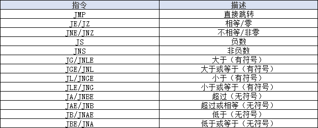

# plan9

[教程1](https://xargin.com/plan9-assembly/)  
[教程2](https://github.com/cch123/golang-notes/blob/master/assembly.md)

### 伪寄存器
```text
FP: Frame pointer: arguments and locals.
PC: Program counter: jumps and branches.
SB: Static base pointer: global symbols.
SP: Stack pointer: top of stack.
```

### x64寄存器
| X64   | rax  | rbx  | rcx  | rdx  | rdi  | rsi  | rbp  | rsp  | r8   | r9   | r10  | r11  | r12  | r13  | r14  | rip  |
| ----- | ---- | ---- | ---- | ---- | ---- | ---- | ---- | ---- | ---- | ---- | ---- | ---- | ---- | ---- | ---- | ---- |
| Plan9 | AX   | BX   | CX   | DX   | DI   | SI   | BP   | SP   | R8   | R9   | R10  | R11  | R12  | R13  | R14  | PC   |

### 后缀
```text
B: 1 byte
W: 2 bytes
D: 4 bytes
Q: 8 bytes
```

### 栈扩大、缩小
```plan9_x86
SUBQ $0x18, SP //push,为函数分配函数栈帧
ADDQ $0x18, SP //pop,清除函数栈帧
```

### 数据copy
```plan9_x86
MOVB $1, DI // 1 byte
MOVW $0x10, BX // 2bytes
MOVD $1, DX // 4 bytes
MOVQ $-10, AX // 8 bytes
```

### 计算
```plan9_x86
ADDQ AX, BX // BX += AX
SUBQ AX, BX // BX -= AX
IMULQ AX, BX // BX *= AX
```

### 比较
```plan9_x86
LONG
CMPQ $2,$1
```

### 跳转
```plan9_x86
//无条件跳转
JMP addr // 跳转到地址，地址可为代码中的地址 不过实际上手写不会出现这种东西
JMP label // 跳转到标签 可以跳转到同一函数内的标签位置
JMP 2(PC) // 以当前置顶为基础，向前/后跳转x行
JMP -2(PC) //同上
//有条件跳转
CMPQ $2,$1
JG label
```



### 声明变量

用法：
```plan9_x86
//GLOBL在DATA之后
DATA symbol+offset(SB)/width,value
GLOBL symbol, NOPTR, $4
```
GOLBL选项：
```text
NOPTR: 没有指针，不被GC扫描
RODATA: 只读数据
```

示例：
```plan9_x86
DATA ·Id+0(SB)/1,$0x37
DATA ·Id+1(SB)/1,$0x25
DATA ·Id+2(SB)/1,$0x00
DATA ·Id+3(SB)/1,$0x00
DATA ·Id+4(SB)/1,$0x00
DATA ·Id+5(SB)/1,$0x00
DATA ·Id+6(SB)/1,$0x00
DATA ·Id+7(SB)/1,$0x00
GLOBL ·Id(SB),$8

DATA ·Name+0(SB)/8,$·Name+16(SB)
DATA ·Name+8(SB)/8,$6
DATA ·Name+16(SB)/8,$"gopher"
GLOBL ·Name(SB),$24
```

### 函数
```plan9_x86
//告诉汇编器该数据放到TEXT区
// |
// |  告诉汇编器这是基于静态地址的数据(static base)
// |        |
// |        |  栈帧大小(局部变量+可能需要的额外调用函数的参数空间的总大小,但不包括调用其它函数时的ret address的大小)
// |        |           |
// |        |           |  参数及返回值大小
// |        |           |  |
// |        |           |  |
TEXT ·Swap(SB),NOSPLIT,$0-32
//     参数a
//       |
    MOVQ a+0(FP), AX  // FP(Frame pointer)栈帧指针 这里指向栈帧最低位
    MOVQ b+8(FP), BX
//        无名返回值0
//              |
    MOVQ BX ,ret0+16(FP)
    MOVQ AX ,ret1+24(FP)
    RET
```

### 函数参数摆放方向
```text
                             FP[test.s](..%2F..%2F..%2Fgolang%2Ftest%2Ftest.s)
high ----------------------> low
argN, ... arg3, arg2, arg1, arg0
```

### 栈结构
```text
                                                                                                                              
                                       caller                                                                                 
                                 +------------------+                                                                         
                                 |                  |                                                                         
       +---------------------->  --------------------                                                                         
       |                         |                  |                                                                         
       |                         | caller parent BP |                                                                         
       |           BP(pseudo SP) --------------------                                                                         
       |                         |                  |                                                                         
       |                         |   Local Var0     |                                                                         
       |                         --------------------                                                                         
       |                         |                  |                                                                         
       |                         |   .......        |                                                                         
       |                         --------------------                                                                         
       |                         |                  |                                                                         
       |                         |   Local VarN     |                                                                         
                                 --------------------                                                                         
 caller stack frame              |                  |                                                                         
                                 |   callee arg2    |                                                                         
       |                         |------------------|                                                                         
       |                         |                  |                                                                         
       |                         |   callee arg1    |                                                                         
       |                         |------------------|                                                                         
       |                         |                  |                                                                         
       |                         |   callee arg0    |                                                                         
       |                         ----------------------------------------------+   FP(virtual register)                       
       |                         |                  |                          |                                              
       |                         |   return addr    |  parent return address   |                                              
       +---------------------->  +------------------+---------------------------    <-------------------------------+         
                                                    |  caller BP               |                                    |         
                                                    |  (caller frame pointer)  |                                    |         
                                     BP(pseudo SP)  ----------------------------                                    |         
                                                    |                          |                                    |         
                                                    |     Local Var0           |                                    |         
                                                    ----------------------------                                    |         
                                                    |                          |                                              
                                                    |     Local Var1           |                                              
                                                    ----------------------------                            callee stack frame
                                                    |                          |                                              
                                                    |       .....              |                                              
                                                    ----------------------------                                    |         
                                                    |                          |                                    |         
                                                    |     Local VarN           |                                    |         
                                  SP(Real Register) ----------------------------                                    |         
                                                    |                          |                                    |         
                                                    |                          |                                    |         
                                                    |                          |                                    |         
                                                    |                          |                                    |         
                                                    |                          |                                    |         
                                                    +--------------------------+    <-------------------------------+         
                                                                                                                              
                                                              callee
```

### 地址运算
```plan9_x86
LEAQ (BX)(AX*8), CX
// 上面代码中的 8 代表 scale
// scale 只能是 0、2、4、8
// 如果写成其它值:
// LEAQ (BX)(AX*3), CX
// ./a.s:6: bad scale: 3

// 用 LEAQ 的话，即使是两个寄存器值直接相加，也必须提供 scale
// 下面这样是不行的
// LEAQ (BX)(AX), CX
// asm: asmidx: bad address 0/2064/2067
// 正确的写法是
LEAQ (BX)(AX*1), CX


// 在寄存器运算的基础上，可以加上额外的 offset
LEAQ 16(BX)(AX*1), CX
```


### 模拟32位
```plan9_x86
MODE $32
```

### 放入指令流
```plan9_x86
LONG $123456
WORD $123456
```

```plan9_x86
TEXT ·Fab(SB),$0-16
    MOVQ n+0(FP), AX
    CMPQ AX, $1
    JBE end
    SUBQ $16, SP
    MOVQ AX, 0(SP)
    DECQ 0(SP)
    CALL ·Fab(SB)
    MOVQ 8(SP), AX
    MOVQ AX, 40(SP)
    DECQ 0(SP)
    CALL ·Fab(SB)
    MOVQ 8(SP), AX
    ADDQ AX, 40(SP)
    ADDQ $16, SP
    RET
end:
    MOVQ $1, ret+8(FP)
    RET
```

### 其他
```plan9_x86
//自增
INCQ AX
//自减
DECQ AX
```


## todo
package main


func g(p int) int {
return p+1;
}

func main() {
c := g(4) + 1
var d bool
if (c > 4) {
d = true
} else {
d = false
}
_ = d
return
}
对应的main的汇编为：

     0x0000 00000 (main.go:8)     TEXT     "".main(SB), $0-0
     0x0000 00000 (main.go:8)     NOP
     0x0000 00000 (main.go:8)     NOP
     0x0000 00000 (main.go:8)     FUNCDATA     $0, gclocals·33cdeccccebe80329f1fdbee7f5874cb(SB)
     0x0000 00000 (main.go:8)     FUNCDATA     $1, gclocals·33cdeccccebe80329f1fdbee7f5874cb(SB)
     0x0000 00000 (main.go:9)     MOVQ     $4, BX
     0x0007 00007 (main.go:9)     INCQ     BX
     0x000a 00010 (main.go:9)     INCQ     BX
     0x000d 00013 (main.go:11)     CMPQ     BX, $4
     0x0011 00017 (main.go:11)     JLE     27
     0x0013 00019 (main.go:12)     MOVQ     $1, AX
     0x001a 00026 (main.go:17)     RET
     0x001b 00027 (main.go:14)     MOVQ     $0, AX
     0x001d 00029 (main.go:17)     JMP     26

jbz,jle