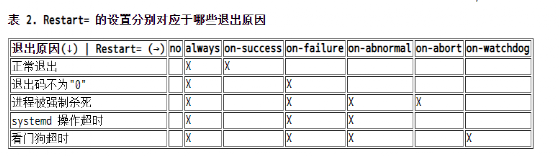

文件位置:
/lib/systemd/system/xxx.service

[教程](https://mp.weixin.qq.com/s/pm7M79kN4eud-K3foBPRZw)

```bash
[Unit]
#服务描述
Description=xxx_server
#之后启动，多个用空格隔开
After=syslog.target network.target

[Service]
#simple（默认值）：systemd认为该服务将立即启动。服务进程不会fork。如果该服务要启动其他服务，不要使用此类型启动，除非该服务是socket激活型。

#forking：ExecStart字段将以fork()方式启动，此时父进程将会退出，子进程将成为主进程。

#oneshot：这一选项适用于只执行一项任务、随后立即退出的服务。可能需要同时设置 RemainAfterExit=yes 使得 systemd 在服务进程退出之后仍然认为服务处于激活状态。
Type=forking

ExecStart=/bin/bash /xxx/runserver.sh

ExecReload=/bin/bash /xxx/restartserver.sh

ExecStop=/bin/bash /xxx/stopserver.sh

PIDFile=/var/run/xxx.pid

#no #默认值，表示不会启动
#on-success #表示仅在服务进程正常退出时重启，退出码为0
#on-failure #表示仅在服务进程异常退出时重启。退出码不为0
#on-abnormal #进程被强制杀死
#on-watchdog #看门狗超时
#on-abort #进程被强制杀死
#always #表示会被无条件的重启

Restart=xxx

[Install]

WantedBy=multi-user.target
```

__重启原因__  


[PID文件说明](https://segmentfault.com/a/1190000019036070)

Example:
```bash
[Unit]
Description=my-service
After=network.target

[Service]
Type=forking
ExecStart=/bin/bash /usr/etc/sh/my-start.sh
ExecStop=/bin/bash /usr/etc/sh/my-stop.sh
Restart=on-abort

[Install]
WantedBy=multi-user.target
```
