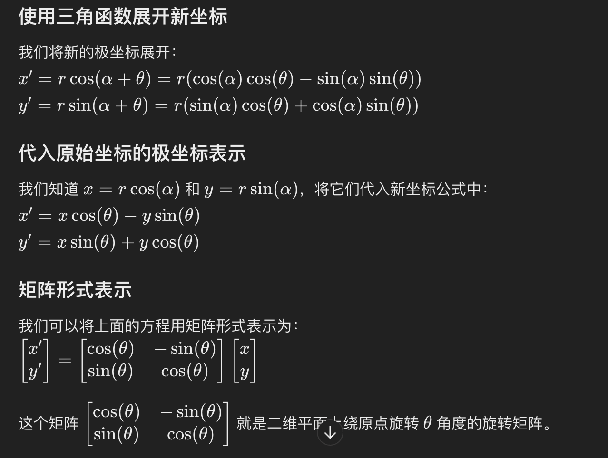
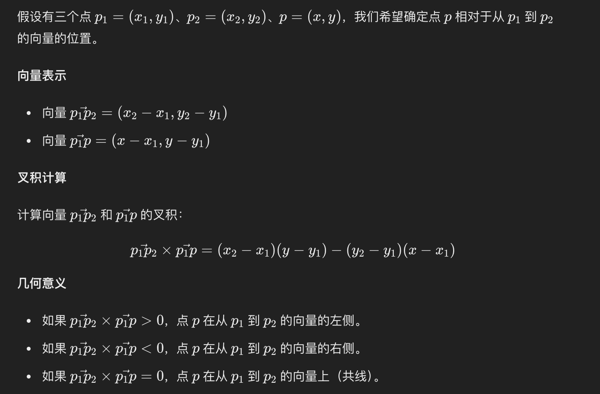
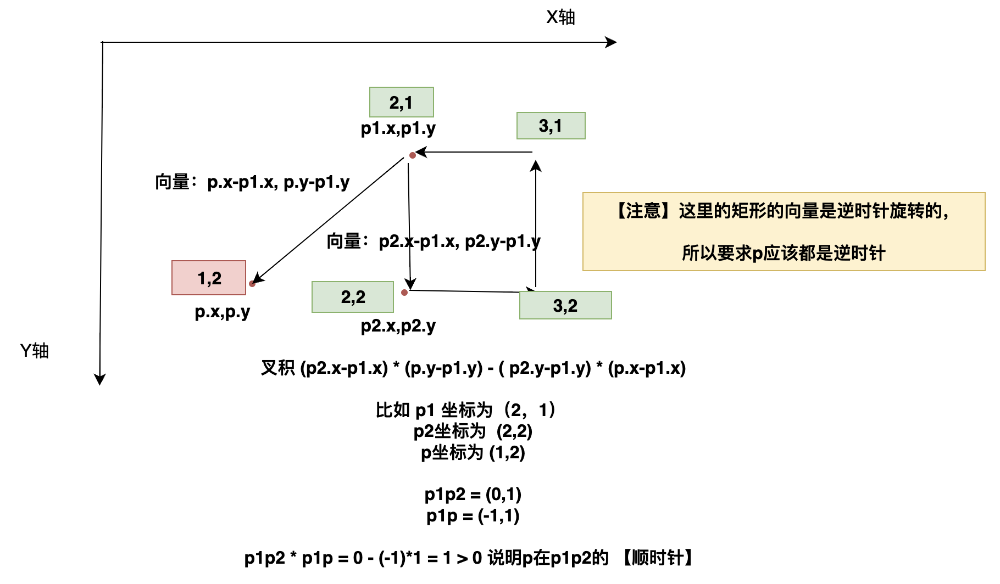
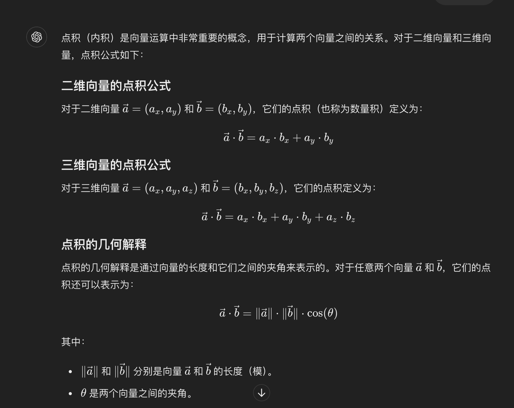
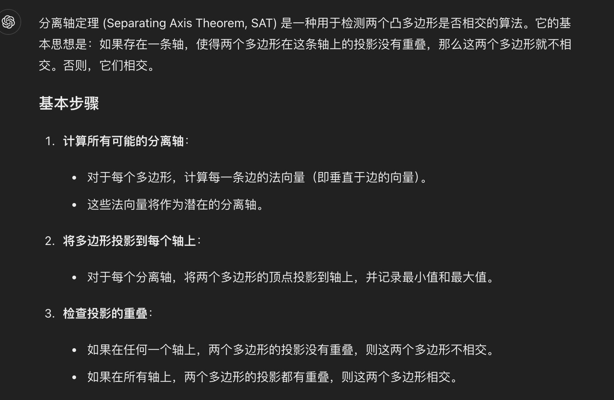
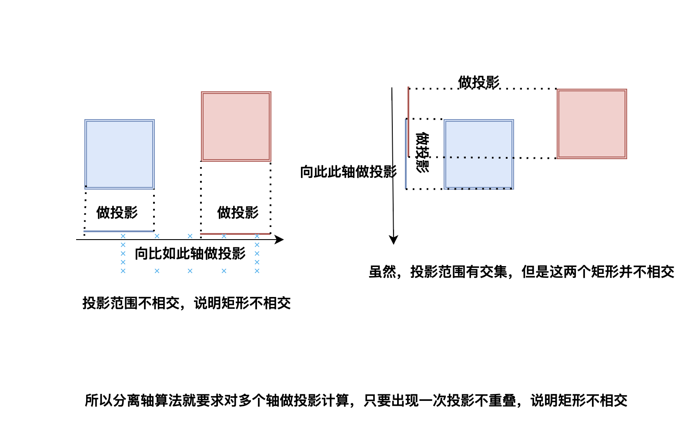

# Maths

这些做碰撞检测需要用的知识点

**旋转矩阵**用来计算坐标点经过旋转后的新的坐标

**叉积公式**

可以用来判断点是否在多边形内部；

代码的中的坐标是向下为Y轴，向右为X轴，所以这里的左边（逆时针），变成顺时针；这里的右边（顺时针），变成了逆时针。

**点积公式**

用来做向量投影计算

> u的大小、v的大小、u,v夹角的余弦。在u,v非零的前提下，点积如果为负，则u,v形成的角大于90度；如果为零，那么u,v垂直；如果为正，那么u,v形成的角为锐角。
>
> 两个单位向量的点积得到两个向量的夹角的cos值，通过它可以知道两个向量的相似性，利用点积可判断一个多边形是面向摄像机还是背向摄像机。
>
> 向量的点积与它们夹角的余弦成正比，因此在聚光灯的效果计算中，可以根据点积来得到光照效果，如果点积越大，说明夹角越小，则物体离光照的轴线越近，光照越强。

**分离轴定理**用来做矩形是否相交的算法

找多边形的每条边的法向量（然后作为轴），让每个多边形的顶点向量（计算点积）向轴进行投影；判断投影是否有重叠。。只要出现一个不重叠的轴，就说明多边形不相交

